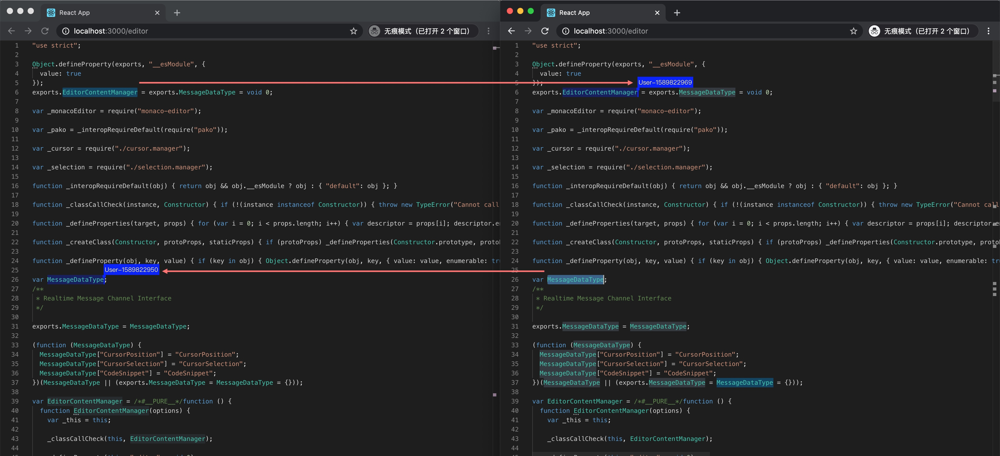

monaco-remote
============

[Monaco Editor](https://github.com/Microsoft/monaco-editor) with remote collaboration.

[![NPM version][npm-image]][npm-url]
[![Downloads][downloads-image]][npm-url]

[](https://npmjs.org/package/monaco-remote)

[npm-url]: https://npmjs.org/package/monaco-remote
[downloads-image]: http://img.shields.io/npm/dm/monaco-remote.svg
[npm-image]: http://img.shields.io/npm/v/monaco-remote.svg



## Installation

```bash
yarn add monaco-remote
```

## Using

### Realtime messaging interface definition
```js
interface IMessage {
  uid?: string;
  message: Uint8Array;
  timestamp?: number;
}

interface IMessageChannel {
  sendMessage(message: IMessage): Promise<void>;
  onReceiver(listener: (message: IMessage) => any): void;
  onMemberJoined(listener: (memberId: string) => any): void;
  onMemberLeft(listener: (memberId: string) => any): void;
}
```

### Monaco editor content manager options
```js
interface IEditorContentManagerOptions {
  editor: editor.IStandaloneCodeEditor;
  channel: IMessageChannel;
}
```

```js
new EditorContentManager({ editor, channel })
```

# License

MIT, see the [LICENSE](/LICENSE) file for detail.
